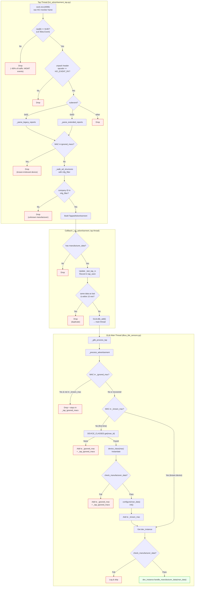

# HCI Monitor Tap — Advertisement Processing Pipeline

## Overview

BLE advertisements are received via an HCI monitor channel tap — a passive,
read-only socket (`HCI_CHANNEL_MONITOR`) that sees ALL HCI traffic between
the host and every Bluetooth controller.  This is the same mechanism that
`btmon` uses.  It bypasses BlueZ's `AdvertisementMonitor1` filtering
entirely, eliminating the need for Bleak, dbus-fast, or any BlueZ scanning
API.

The tap does not issue any commands and does not interfere with BlueZ or
tie up any adapter.

## Scan type

The tap scans **passively** by default: it listens, and never transmits the
SCAN_REQ that an active scanner sends to every advertiser in range.  On a
gateway sharing a few radios with BMS links, that is the difference between
coexisting and interfering.

`/Settings/BleSensors/ActiveScan` switches the controller to active
scanning.  Turn it on only when a device needs it — some Victron firmwares
moved the encrypted instant-readout record out of the primary advertisement
and into the SCAN_RSP, which a passive scanner never solicits, so the unit
shows only its short product-id beacon and reads as off.  Active delivers
everything passive does plus the scan responses, and the tap parses them
through the same LE Advertising Report path, so nothing downstream changes.

The toggle re-applies immediately (same path as `ContinuousScan`) rather
than waiting for the 60 s scan-re-enable tick.

## Adapter identity

**An adapter is its MAC.  `hciN` is only what it is called right now.**

The numbering is not stable: a USB reset renumbers a card, so does
replugging, and so does a reboot.  On dev-cerbo the onboard Broadcom failed
its firmware reset one boot —

```
Bluetooth: hci1: BCM: failed to write update baudrate (-110)
Bluetooth: hci1: BCM: Reset failed (-110)
```

— and the USB dongle that had been `hci1` came up as `hci0`.  Everything
this service remembered about "hci1" then referred to a different physical
radio.

So state is keyed by the adapter's MAC (colons stripped, uppercase) and the
`hciN` is resolved from it immediately before each HCI socket call, never
cached across one.  `adapter_identity.py` does the resolving, borrowing
bcmv2's resolver rather than growing a second one — it already knows that
Venus OS populates no sysfs `address` attribute for any adapter, so the
whole table comes from a single `hciconfig` call behind a short-lived cache.
BlueZ hands us the `Address` property when an adapter appears, so the
common path costs nothing extra.

`adapter-allowlist.conf` takes **adapter MACs**, in any spelling:

```
# Scan only on the USB dongle; leave the onboard radio for the BMS.
00:01:95:40:C3:33
```

`hciN` entries still work and are matched against the name BlueZ is
currently using — but they name a number rather than a card, and that
reservation protects the wrong radio the moment the numbering changes.
Since the file exists precisely to reserve a card for another BLE service,
getting it backwards means scanning the card you promised to leave alone.

## Relationship to the connection path

This is the **inbound** half of the Bluetooth stack only.  Outbound GATT —
charger setpoints, key provisioning — is a separate stack: bleak, routed
through bcmv2 for claim-aware adapter placement.  The two meet only in
`/run/bt-claims`, where the tap publishes a soft claim per adapter it has
passive scan enabled on so connections rank around it.  See
[`ble-connection-layer.md`](ble-connection-layer.md).

## Processing Pipeline

The diagram below shows every filter stage a raw HCI packet passes through
before reaching a device class.  Red nodes are drop points; the green node
is the final delivery.



## Filter Stages

| # | Stage | Location | Thread | What it drops |
|---|-------|----------|--------|---------------|
| 1 | Event code fast-path | `parse_monitor_frame` | Tap | ~80% of raw traffic (MGMT events, non-LE) |
| 2 | Opcode check | `parse_monitor_frame` | Tap | Non-`HCI_EVENT_RX` frames |
| 3 | Subevent check | `parse_monitor_frame` | Tap | Non-advertising LE Meta subevents |
| 4 | MAC-level filter | `_parse_legacy/extended_reports` | Tap | Previously-rejected MACs (before AD parsing) |
| 5 | Manufacturer ID filter | `_walk_ad_structures` | Tap | Unknown company IDs |
| 6 | Deduplication | `_on_advertisement` | Tap | Identical data from same MAC within 15 min |
| 7 | Thread boundary | `GLib.idle_add()` | Tap → Main | *(not a filter — bridges to main thread)* |
| 8 | `_ignored_mac` check | `_process_advertisement` | Main | MACs rejected in a prior cycle |
| 9 | Device class lookup | `_process_advertisement` | Main | Manufacturer IDs with no registered `BleDevice` subclass |
| 10 | `check_manufacturer_data` | `_process_advertisement` | Main | Device-specific validation (e.g., Mopeka NIC check) |
| 11 | Delivery | `handle_manufacturer_data` | Main | *(final delivery to device class)* |

## Threading Model

Two threads cooperate:

- **Tap thread** (`hci-monitor-tap`): runs `run_tap_loop`, calls
  `_on_advertisement` on the tap thread.  All filtering through stage 6
  happens here.  The `_tap_ignored_macs` set is shared with the main
  thread (CPython GIL guarantees safety for `in` and `add()`).

- **GLib main thread**: runs the GLib main loop, handles D-Bus.  Stages
  8–11 execute here.  The `_prune_tick` timer (every 30s) syncs the
  ignored MAC set: entries that expired from `_ignored_mac` or were
  promoted to `_known_mac` are removed from `_tap_ignored_macs` so
  those devices can be re-evaluated.

## Key Constants

| Constant | Value | Purpose |
|----------|-------|---------|
| `DEDUP_KEEPALIVE_SECONDS` | 900 (15 min) | Re-forward identical data as a keepalive |
| `IGNORED_DEVICES_TIMEOUT` | 600 (10 min) | TTL for ignored MAC entries |
| `DEVICE_SERVICES_TIMEOUT` | 3600 (60 min) | TTL for known device entries |
| `SILENCE_WARNING_SECONDS` | 300 (5 min) | Warn if no matching advertisements |
| `ADV_LOG_QUIET_PERIOD` | 1800 (30 min) | Per-device log throttle period |
